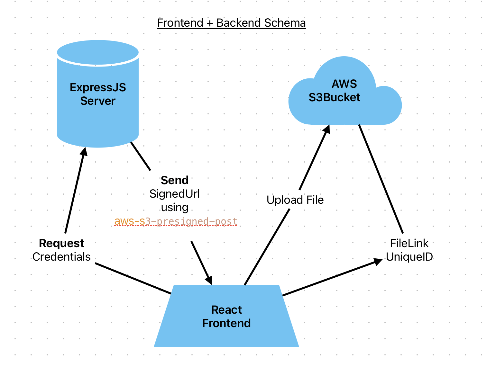

# FullDevLekce7
- React application that will upload any file to the AWS S3 Bucket using ExpressJS as middleman.



## Domácí úkol 7

- Deadline: 1.1.2024 23:59

__Cílem tohoto úkolu je implementovat modul pro file storage__

- implementuj modul `FileStorage`, ktery bude mít následující metody
    -  [x] upload - pro nahrání souboru
    - [x] download - pro stažení/vrácení obsahu souboru
    - [ ] delete - smazání souboru //Still buggy 
    - [x] list - seznam souborů
- pro jednoduchost není třeba uvažovat složky, pouze flat strukturu
- [x] samozřejmě pokud chcete implementujte i složky 😃

## Screenshots

)

## Notes
- jelikož `@aws-sdk` je jako ES modul, tak bude třeba udělat i aplikaci jako `type: module` (viz. [package.json v lesson7-s3](../lesson7-s3/package.json))
- doporučuju používat třidy, jak na to v rychlosti zde: https://developer.mozilla.org/en-US/docs/Web/JavaScript/Reference/Classes

## Dependencies

```javascript

pnpm i express cors dotenv uuid aws-sdk @aws-sdk/client-s3

```
- To generate a S3SignedUrl (basically a Token) I am using ``@aws-sdk/s3-presigned-post``. 
